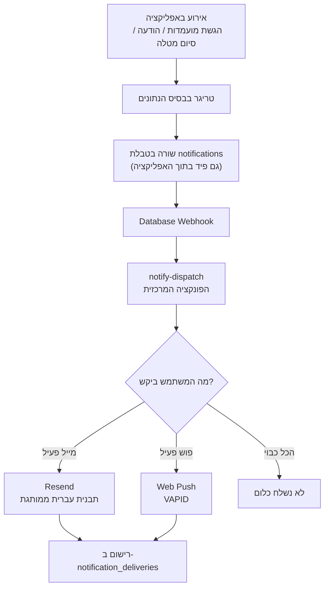

# תוכנית מערכת ההתראות של BZB — מייל + פוש

מסמך תכנון מקצה לקצה. נכתב ב־1 באוגוסט 2026.

> **סטטוס: כל השלבים מומשו ונמצאים ב־main.**
> הקוד לא ישלח כלום עד שמבצעים את ההגדרות ב־[notifications-setup.md](notifications-setup.md) —
> בלי מפתחות וסודות Vault, הטריגרים הופכים ל־no-op והאפליקציה ממשיכה לעבוד רגיל.

---

## 1. תמונת המצב היום

**מה קורה כרגע באפליקציה:** שום דבר לא יוצא החוצה. כל האינטראקציה בין הצדדים שקטה לגמרי — בייבי מגיש מועמדות, ובעל המטלה יגלה את זה רק אם ייכנס לאפליקציה ויבדוק. הודעה בצ'אט פשוט מחכה. מטלה מסתיימת ואף אחד לא מקבל אישור.

**מצב המיילים:**

| מה | מצב |
|---|---|
| מייל אימות הרשמה | נשלח, אבל בתבנית ברירת המחדל של Supabase — אנגלית, בלי מיתוג |
| מייל איפוס סיסמה | אותו דבר |
| פונקציית `send-password-reset` (עם Resend ותבנית בעברית) | **קוד מת** — אף אחד באפליקציה לא קורא לה |
| כל שאר המיילים | לא קיימים |

**מצב הפוש:** אין. אין manifest, אין service worker, האפליקציה בכלל לא PWA.

**מה חסר בתשתית:** אין טבלת התראות, אין העדפות משתמש, אין מנגנון תזמון (cron), אין מקום אחד שאחראי על שליחה.

---

## 2. מה אנחנו בונים — בשפה פשוטה

צינור אחד מרכזי שכל התראה עוברת דרכו.

כשקורה משהו באפליקציה (מישהו הגיש מועמדות, נשלחה הודעה, מטלה הושלמה), המערכת רושמת "אירוע" בבסיס הנתונים. משם רכיב אחד — **המפיץ** — לוקח את האירוע, בודק מה המשתמש ביקש לקבל, ושולח בהתאם: מייל, פוש, שניהם, או כלום.

למה זה חשוב שיהיה מקום אחד: יש 7 סוגי התראות ו־3 ערוצים (מייל, פוש, פעמון). אם נפזר את הלוגיקה בין מסכים שונים באפליקציה — נשכח מקרים, נשלח כפולים, ולא נדע לאבחן תקלות. מקום אחד = כל התראה נרשמת, ניתנת למעקב, וניתנת לכיבוי.

בנוסף, המשתמש מקבל **מסך הגדרות** עם מתגים: לכל סוג התראה, בנפרד — האם לקבל במייל, והאם לקבל בפוש.

---

## 3. שבע ההתראות

| # | האירוע | מי מקבל | מייל | פוש | תזמון |
|---|---|---|---|---|---|
| 1 | הוגשה מועמדות למטלה שלי | בעל המטלה | ✅ | ✅ | מיידי |
| 2 | המועמדות שלי התקבלה / נדחתה | המועמד | ✅ | ✅ | מיידי |
| 3 | הודעה חדשה בצ'אט | הצד השני | ✅ מקובץ | ✅ | פוש מיידי, מייל מקובץ |
| 4 | המטלה הושלמה | שני הצדדים | ✅ | ✅ | מיידי |
| 5 | דוח יומי על הילד | ההורה | ✅ | ✅ | פעם ביום, שעה לבחירה |
| 6 | קוד קישור משפחתי | ההורה | ✅ | — | לפי בקשה |
| 7 | הילד התקבל למטלה | ההורה | ✅ | ✅ | מיידי |

### הערות חשובות לכל אחד

**1 — הגשת מועמדות.** הכי קריטי עסקית. בלי זה, בעל מטלה לא יודע שיש לו מועמד, המועמד לא מקבל תשובה, והמטלה מתה. המייל יכלול את שם המועמד, גיל, וקישור ישיר לאישור/דחייה.

**2 — קבלה/דחייה.** צד שני של אותו מטבע. חשוב במיוחד לדחייה — נוער שלא מקבל תשובה מפסיק להשתמש באפליקציה.

**3 — צ'אט.** כאן צריך זהירות. אם נשלח מייל על כל הודעה, נציף את המשתמש ונשרוף את מכסת המיילים. הכלל: **פוש מיידי תמיד, מייל רק אם הנמען לא היה פעיל באפליקציה 10 דקות ולא נשלח לו מייל על אותה שיחה בשעה האחרונה.** המייל יסכם "יש לך 3 הודעות חדשות מדני" ולא יעתיק את תוכן ההודעות.

**4 — סיום מטלה.** מייל אישור לשני הצדדים, עם סיכום: שם המטלה, תאריך, סכום. משמש גם כתיעוד.

**5 — דוח יומי להורה.** נשלח פעם ביום עם סיכום פעילות הילד: מועמדויות שהוגשו, תשובות שהתקבלו, מטלות שהושלמו, וכמה הרוויח. **אם אין פעילות — לא נשלח כלום.** לחיצה על הפוש פותחת מסך דוח ייעודי באפליקציה (ראו סעיף 6).

**6 — קוד קישור משפחתי.** היום הקוד מוצג רק על המסך של הילד. נוסיף אפשרות "שלח את הקוד למייל של ההורה" למקרה שההורה לא ליד המכשיר.

**7 — הילד התקבל למטלה.** ההתראה המיידית היחידה שההורה מקבל, וזאת בכוונה: קבלה למטלה היא הרגע שבו הילד עומד לצאת פיזית לעבוד אצל אדם זר. ההורה צריך לדעת את זה עכשיו, לא בערב. כל שאר האירועים (הגשות, דחיות, סיומים) מחכים לדוח היומי כדי לא להציף.

---

## 4. איך זה עובד מקצה לקצה

**נקודת המפתח:** האירוע נרשם בבסיס הנתונים *לפני* השליחה. זה אומר:

- אם השליחה נכשלה — האירוע לא אבד, אפשר לנסות שוב
- אותה שורה משמשת גם כפיד התראות *בתוך* האפליקציה (פעמון עם מונה)
- אפשר לראות בדיוק מה נשלח, למי, ומתי — לצורכי תמיכה ואבחון

הכיוון ההפוך — קריאה לשליחת מייל ישירות מהמסך — נשבר ברגע שהמשתמש סוגר את הדפדפן באמצע, או ששינוי הסטטוס קורה משני מסכים שונים (וזה בדיוק המצב היום: סטטוס מועמדות משתנה גם ב־TaskDetail וגם ב־MyTasks וגם ב־Admin).

---

## 5. מסך ההגדרות

מסך חדש בכתובת `/settings`, נגיש מהתפריט ומהפרופיל.

### מבנה

**חלק א׳ — הפעלת פוש**
כפתור אחד: "הפעל התראות במכשיר הזה". לוחצים, הדפדפן מבקש רשות, נרשמים. אם המשתמש כבר רשום — מוצג "פעיל במכשיר הזה" עם אפשרות ניתוק.

**חלק ב׳ — טבלת המתגים**
שורה לכל התראה רלוונטית, שתי עמודות: 📧 מייל, 🔔 פוש. המשתמש רואה רק את ההתראות שמתאימות לתפקיד שלו — בעל מטלה לא רואה "המועמדות שלי התקבלה", והורה רואה רק את הדוח היומי ואת "הילד התקבל למטלה".

**חלק ג׳ — שעת הדוח היומי** (מוצג להורים בלבד)
בורר שעה. ההורה בוחר מתי לקבל את הסיכום היומי. ברירת מחדל 20:00.

**חלק ד׳ — שעות שקטות**
"אל תשלח לי פוש בין 22:00 ל־07:00". חשוב במיוחד באפליקציה שהמשתמשים שלה הם נוער. התראות שנחסמות בשעות השקט נשלחות בבוקר, לא נמחקות.

### ברירות מחדל

| התראה | מייל | פוש |
|---|---|---|
| הגשת מועמדות | פעיל | פעיל |
| קבלה/דחייה | פעיל | פעיל |
| צ׳אט | פעיל (מקובץ) | פעיל |
| סיום מטלה | פעיל | כבוי |
| דוח יומי להורה | פעיל | פעיל |
| הילד התקבל למטלה | פעיל | פעיל |

העיקרון: מה שקריטי לתפקוד — פעיל כברירת מחדל. מה שהוא "נחמד לדעת" — כבוי. פוש בכל מקרה לא עובד עד שהמשתמש נותן רשות בדפדפן, אז אין סיכון להצפה.

### קישור מהמייל

בתחתית כל מייל יופיע קישור "נהל את העדפות ההתראה שלך" שמוביל ישירות ל־`/settings`. זה סטנדרט בכל מערכת התראות רצינית, ומקטין דיווחי ספאם — משתמש שרוצה פחות מיילים מכבה מתג במקום ללחוץ "דווח כספאם", מה שפוגע בדירוג המסירה של כל המערכת.

---

## 6. הדוח היומי ומסך הדוח

**התזמון:** כל הורה בוחר את השעה שלו במסך ההגדרות. ברירת מחדל 20:00 שעון ישראל — אחרי שעות הפעילות של הילדים.

מבחינה טכנית זה אומר ש־cron רץ **כל שעה עגולה**, ובכל ריצה שולח רק להורים שבחרו את השעה הזו. פשוט, ולא דורש מנגנון תזמון פר־משתמש.

**התוכן:** לכל הורה, לכל ילד מקושר — מה קרה היום. אם לא קרה כלום אצל אף ילד, לא נשלח דוח.

**המסך:** כתובת חדשה `/parent/report/:date`. לחיצה על הפוש או על הכפתור במייל פותחת ישירות את הדוח של אותו יום, בעיצוב נעים: כרטיס לכל ילד, ציר זמן של האירועים, סיכום הכנסות, ומטלה פעילה אם יש. ניווט בין ימים (חץ אחורה/קדימה).

הנתונים למסך הזה כבר קיימים — `ParentalHub.tsx` מחשב אותם היום. ההבדל: המסך החדש מציג יום ספציפי במקום מצב נוכחי, והוא היעד שאליו הפוש מוביל.

---

## 7. הארכיטקטורה הטכנית

### רכיבים חדשים

**בצד השרת (Supabase Edge Functions):**

| פונקציה | תפקיד |
|---|---|
| `_shared/email.ts` | מודול משותף: תבנית HTML ממותגת בעברית RTL + שולח Resend. כל מייל במערכת עובר דרכו |
| `_shared/push.ts` | מודול משותף: שליחת Web Push עם VAPID |
| `send-auth-email` | **Send Email Hook** של Supabase — משתלט על *כל* מיילי האימות (הרשמה, איפוס סיסמה, שינוי מייל) ושולח אותם ממותגים בעברית דרך Resend |
| `notify-dispatch` | המפיץ המרכזי — מקבל אירוע, קורא העדפות, שולח בערוצים המתאימים |
| `send-parent-digest` | בונה ושולח את הדוח היומי (מופעל ע״י cron) |
| `push-subscribe` | רישום/ביטול רישום של מכשיר לפוש |

**נמחק:** `send-password-reset` — קוד מת שמוחלף ע״י `send-auth-email`.

### איחוד המיילים

היום יש שני "צינורות" מייל נפרדים: המנגנון המובנה של Supabase, וקוד Resend מותאם. הפתרון הוא **Send Email Hook** — מנגנון של Supabase שבו במקום ש־Supabase ישלח מייל, הוא שולח בקשה לפונקציה שלנו, ואנחנו שולחים. התוצאה: כל מייל במערכת — אימות הרשמה, איפוס סיסמה, התראות — יוצא מאותה תבנית ממותגת, מאותו דומיין, עם אותו מעקב.

### בצד הלקוח

- **PWA מלא:** `manifest.webmanifest`, service worker, אייקונים בכל הגדלים. אין היום — צריך לבנות
- **מסך התקנה:** באנר שמסביר לאייפון איך להוסיף למסך הבית (בלי זה אין פוש באייפון בכלל)
- **מסך `/settings`** עם המתגים
- **מסך `/parent/report/:date`**
- **פעמון התראות** בתפריט העליון עם מונה לא־נקראות

### תקן איכות למיילים

התבנית תעמוד בסטנדרט המקובל למיילים טרנזקציוניים:

- מבנה טבלאות ו־CSS inline (הדרישה של לקוחות מייל)
- `dir="rtl"` + UTF-8 לעברית תקינה
- גרסת טקסט פשוט לצד ה־HTML — לנגישות ולדירוג מסירה
- טקסט preheader (השורה שנראית בתצוגה המקדימה)
- כפתור "bulletproof" שעובד גם ב־Outlook, עם קישור טקסט גיבוי מתחתיו
- תמיכה במצב כהה
- בלי תמונות חיצוניות — לוגו טקסטואלי, כדי שהמייל ייראה נכון גם כשתמונות חסומות
- SPF, DKIM ו־DMARC על הדומיין

---

## 8. סכימת הנתונים

ארבע טבלאות חדשות:

**`notification_preferences`** — מה כל משתמש רוצה לקבל
`user_id`, `event_type`, `email_enabled`, `push_enabled`

**`notification_settings`** — הגדרות ברמת המשתמש (שורה אחת לכל משתמש)
`user_id`, `digest_hour` (ברירת מחדל 20), `quiet_hours_start`, `quiet_hours_end`, `timezone`
עמודות שעות השקט נכנסות לסכימה כבר עכשיו, גם אם הלוגיקה תופעל רק בשלב 5 — כדי לא להצטרך מיגרציה שנייה.

**`push_subscriptions`** — מכשירים רשומים לפוש
`user_id`, `endpoint`, `p256dh`, `auth`, `user_agent`, `last_seen_at`
משתמש אחד יכול להיות רשום מכמה מכשירים. מנוי שהשרת מדווח עליו כמת (410/404) נמחק אוטומטית.

**`notifications`** — האירועים עצמם, וגם הפיד בתוך האפליקציה
`user_id`, `type`, `title`, `body`, `data` (jsonb), `link`, `read_at`, `created_at`

**`notification_deliveries`** — יומן שליחה
`notification_id`, `channel`, `status`, `error`, `sent_at`
נועד לאבחון ("למה לא קיבלתי מייל?") ולמניעת שליחה כפולה.

כל הטבלאות עם RLS: משתמש רואה רק את השורות שלו. הכתיבה נעשית ע״י תפקיד השירות בלבד.

---

## 9. שלבי הביצוע

| שלב | מה נבנה | תוצאה מוחשית |
|---|---|---|
| **0** | מודול המייל המשותף + `send-auth-email` + מחיקת הקוד המת | כל מיילי האימות והסיסמה יוצאים ממותגים בעברית |
| **1** | הטבלאות + מסך ההגדרות (מייל בלבד) | משתמש יכול להגדיר העדפות |
| **2** | התראות 1, 2, 4 במייל | הליבה העסקית מכוסה — מועמדות, תשובה, סיום |
| **3** | פעמון התראות באפליקציה | כל משתמש רואה את ההתראות שלו, בלי תלות במייל או פוש |
| **4** | תשתית PWA + service worker + מסך התקנה | האפליקציה ניתנת להתקנה |
| **5** | רישום פוש + ערוץ הפוש במפיץ | אותן התראות מגיעות גם כפוש |
| **6** | צ׳אט עם קיבוץ + הפעלת שעות שקטות | התראות צ׳אט בלי הצפה ובלי לילות |
| **7** | דוח יומי + מסך הדוח + cron + התראת "הילד התקבל" | ההורה מכוסה |
| **8** | קוד משפחתי במייל | השלמה |

**סדר העדיפויות:** שלבים 0–3 נותנים את מרבית הערך העסקי. הפוש (4–5) הוא שיפור חוויה, לא תנאי לתפקוד — ובאייפון הוא ממילא תלוי בכך שהמשתמש יתקין את האפליקציה למסך הבית.

**למה הפעמון לפני הפוש:** הפעמון הוא הערוץ היחיד עם הגעה של 100%. מייל עלול ליפול לספאם, פוש דורש אישור מפורש ובאייפון גם התקנה למסך הבית. הפעמון עובד לכולם, תמיד — והנתונים כבר יושבים בטבלה, אז זו עבודת ממשק בלבד ולא תשתית חדשה.

---

## 10. סיכונים והחלטות שצריך לקבל

### סיכונים

**אייפון.** פוש עובד רק אם המשתמש הוסיף את האפליקציה למסך הבית (iOS 16.4+). זה חיכוך אמיתי — חלק ניכר מהמשתמשים לא יעשו את זה. **המסקנה: המייל הוא הערוץ העיקרי, הפוש הוא תוספת.** אסור לבנות תהליך עסקי שתלוי בפוש בלבד.

**מכסת מיילים.** Resend בחינם = 100 מיילים ביום. עם התראות צ׳אט זה ייגמר מהר. הקיבוץ שתוכנן מקטין את זה משמעותית, אבל צריך לתכנן מעבר לתוכנית בתשלום.

**קהל היעד קטינים.** האפליקציה מיועדת לנוער. מיילים טרנזקציוניים מותרים, אבל כל תוכן שיווקי דורש הסכמה נפרדת לפי חוק התקשורת — מה שמדיניות הפרטיות כבר מזכירה. **הפרדה מוחלטת בין התראות תפעוליות לבין דיוור שיווקי.**

**דומיין שולח.** היום `onboarding@resend.dev`. חייבים דומיין אמיתי עם SPF/DKIM/DMARC, אחרת המיילים ייפלו לספאם.

### החלטות שהתקבלו (1 באוגוסט 2026)

| # | ההחלטה | מה נקבע |
|---|---|---|
| 1 | דומיין שולח | **`onboarding@resend.dev` בינתיים.** בונים עם כתובת הבדיקה של Resend ומחליפים לדומיין אמיתי לפני עלייה לאוויר. ⚠️ חוסם ייצור — לא לשחרר למשתמשים אמיתיים לפני ההחלפה |
| 2 | התראות להורה | **מיידי על קבלה למטלה + דוח יומי לכל השאר.** נוסף סוג התראה שביעי |
| 3 | שעת הדוח | **לבחירת ההורה במסך ההגדרות**, ברירת מחדל 20:00. cron רץ כל שעה ושולח למי שבחר את השעה הזו |
| 4 | פעמון התראות | **נכנס לגרסה הראשונה**, בשלב 3 — לפני הפוש |
| 5 | שעות שקטות | **הסכימה עכשיו, הלוגיקה בשלב 6** יחד עם התראות הצ׳אט |

### מה עוד פתוח

- **רכישת דומיין** והגדרת SPF/DKIM/DMARC — לפני עלייה לייצור
- **מעבר לתוכנית Resend בתשלום** כשנחצה 100 מיילים ביום

---

## נספח: מקורות

- [Custom Auth Emails with React Email and Resend — Supabase Docs](https://supabase.com/docs/guides/functions/examples/auth-send-email-hook-react-email-resend)
- [Get Started with Resend and Supabase](https://resend.com/docs/knowledge-base/getting-started-with-resend-and-supabase)
- [iOS special requirements for web push notifications — Pushpad](https://pushpad.xyz/blog/ios-special-requirements-for-web-push-notifications)
- [PWA iOS Limitations and Safari Support](https://www.magicbell.com/blog/pwa-ios-limitations-safari-support-complete-guide)
- [Transactional Email Best Practices — MailerSend](https://www.mailersend.com/blog/transactional-email-best-practices)
- [HTML email best practices — Zoho ZeptoMail](https://www.zoho.com/zeptomail/articles/html-email-best-practices.html)
